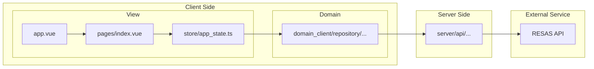

## About

A web application to show the population trends in Japan.

```bash
# Make sure to install the dependencies
npm install
```

```bash
# Start the development server on `http://localhost:3000`
npm run dev
```

```bash
# Build the application for production
npm run build
```

```bash
# Locally preview production build
npm run preview
```

## Configurations

In `.env`:

- RESAS_API_KEY

In `app.config.ts`:

- useMock (default: false)

## Design document

### Libraries

Core:

- Nuxt.js
- Vue.js

State management:

- Pinia

Chart:

- vue-chartjs
- Chart.js

Reset CSS:

- ress

Validation:

- zod

Linter & formatter:

- ESLint
- Prettier

### Flow of acquiring data



### Project structure

#### Views

- app.vue
- pages/\*.vue
- components/\*.vue

#### States for views

- store/\*.ts
  - Pinia's stores.
  - These stores acquire repositories by `inject()`.

#### Domain for client

- domain_client/
  - repository/
    - repos.ts
      - All repositories are created here.
    - repo\_\*.ts
      - Interfaces.
    - mock/\*.ts
      - Offline mock.
    - impl/\*.ts
      - Actual implementation.

#### Domain for client/server

- domain_common/
  - entity/\*.ts
    - Entities for client/server.
    - Server returns these entities.

#### Server

- server/api/\*.ts
  - Server to access external service.

### Dependency injection

- The `app.vue` provide repositories by Vue's `provide()`.
- The stores acquire repositories by Vue's `inject()`.

### Localization

- i18n.config.ts
  - Languages: en, ja
